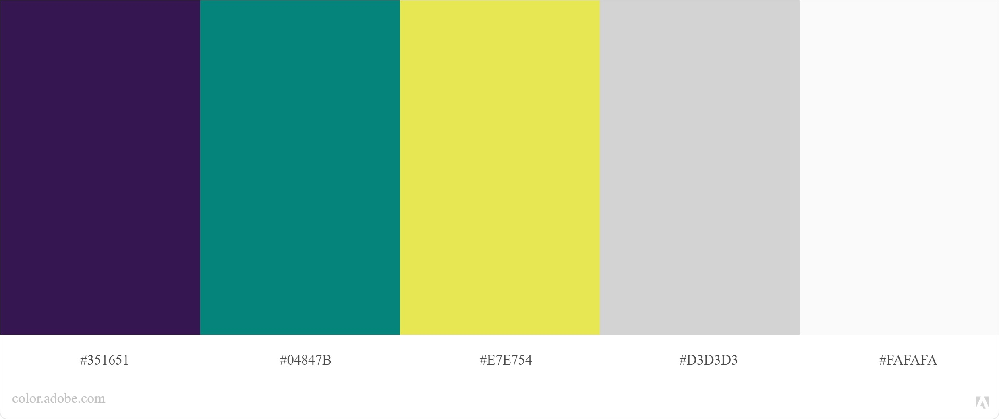

# Reto-Finaktiva

## Definición del producto

Finaktiva es una plataforma de crédito digital, donde desarrollan soluciones de inclusión financiera para potenciar el crecimiento del emprendimiento de alto impacto y las Pyme en Colombia.

Los clientes/usuarios son emprendedores que necesitan financiación para crecer. Cuando adquieren su crédito necesitan un espacio en la plataforma que les brinde claridad en su proceso.

## Pruebas de usabilidad: 

Se realizaron varias pruebas de usabilidad en las que el usuario estuvo cerca de 20 minutos interactuando con la plataforma y definiendo como le gustaría tener su propio espacio en ella, personas emprendedoras entre 22–42 años que deseaban adquirir un crédito.
Estos casos particulares fueron los que destacaron ya que son dos experiencias diferentes.

* Individuo 25 años Hombre:
El usuario esta familiarizado con los portales de pago y cree que son algo complicados de entender, le gustaría tener una pantalla principal en donde se puedan ver sus créditos actuales y un botón que lo redireccione a su historial de sus créditos anteriores y otro que lo direccione a una nueva solicitud de crédito, en la sección del perfil le parece bien tener una imagen de su empresa y sus datos, también tener algunos recordatorios generales y recursos que la plataforma le pueda ofrecer.

* Individuo 45 años Mujer: 
En este caso a el usuario no le parece tan necesaria solo una sección para el perfil y su empresa ya que no tendría mucha información, se le facilitaría más tener esta sección en la vista principal con un pequeño resumen y encontrar las  categorías en la que podrá tene la información de su crédito a la actual, su historial de créditos y solicitudes y la posibilidad de solicitar un nuevo crédito.

## Flujo de navegación

## UI

## Wireframes.
Bocetos: De acuerdo a las pruebas de usabilidad y el mapa de navegación realice los bocetos manuales para proseguir con los wireframes de baja y alta fidelidad.

Wireframes de baja fidelidad. 
Para realizar los wireframes de de baja fidelidad me apoyé en el software Mockup Plus y Cacoo.

Wireframes de Alta fidelidad.
El prototipo final se realizó en Figma.

## Modboard: 
Tome como referente la pagina Finaktiva para mantener una armonía visual uniforme, tomando principalmente como referencia el componente de Calcula tu crédito y sus elementos.
Procedí a generar la guía de estilos, donde se definen los colores, fuentes, botones e iconos en el estilo lineal tal cual están en la página principal de Finaktiva. 

